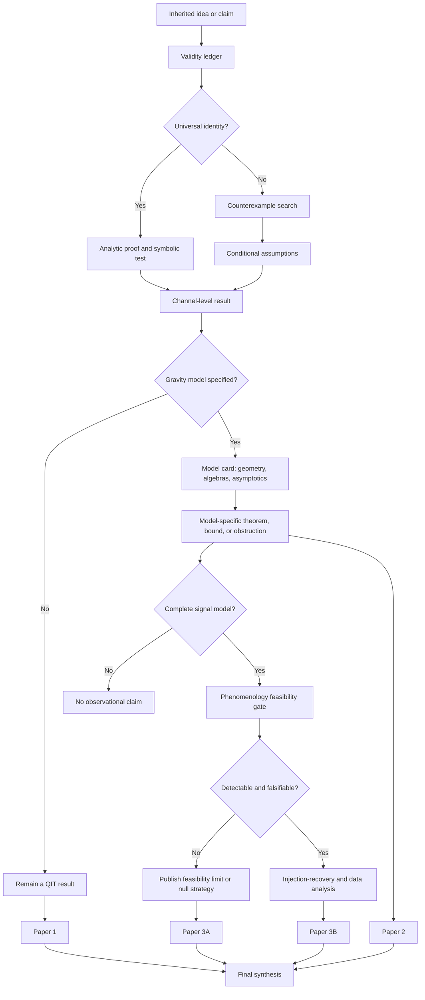

# Research Manifold

## Purpose

The research manifold is the project’s navigation system. It prevents a result proved in one mathematical or physical setting from being silently promoted into a universal claim.

Each research claim occupies a coordinate

\[
\mathfrak C=(A,M,Q,O,E,P),
\]

where:

- **A — Assumptions:** unitarity, purity, dimensional bounds, conservation laws, locality, asymptotics, code subspace, accessibility.
- **M — Model:** abstract channel, holographic toy model, loop-inspired effective geometry, remnant model, or phenomenological source model.
- **Q — Quantity:** entropy, mutual information, coherent information, recovery fidelity, capacity, flux, duration, or event rate.
- **O — Observer or output algebra:** complete radiation, a radiation subregion, exterior algebra, remnant sector, boundary region, or detector.
- **E — Evidence:** proof, counterexample, symbolic test, numerical result, primary source, simulation, or observation.
- **P — Publication state:** hypothesis, internal result, validated result, preprint-ready, submitted, or published.

A statement may move through the manifold only when all six coordinates are recorded.

---

## Core path



---

## Manifold layers

### Layer 0 — Language and definitions

**Question:** Are all systems, states, algebras, channels, and observers defined?

Required artifacts:

- notation table;
- subsystem diagram;
- distinction between the input system and its purifying reference;
- operational definition of “information is recoverable.”

Exit condition: no mutual-information expression contains systems that do not coexist in one state.

### Layer 1 — Quantum-information kinematics

**Question:** What follows from quantum mechanics alone?

Required artifacts:

- entropy identities;
- feasible information-localization region;
- extremal channels and counterexamples;
- recovery and decoupling metrics.

Exit condition: every proposed universal claim has survived explicit channel counterexamples.

### Layer 2 — Additional physical constraints

**Question:** Which assumptions reduce the generic channel freedom?

Candidate constraints:

- global and local conservation laws;
- covariance or symmetry;
- finite remnant dimension;
- energy constraints;
- locality and causal accessibility;
- semiclassical exterior dynamics;
- no-baby-universe assumption;
- asymptotic completeness.

Exit condition: each bound lists the assumption responsible for it.

### Layer 3 — Gravitational embedding

**Question:** Does a specified geometry or duality realize the assumed channel?

Required artifacts:

- causal diagram;
- model equations;
- asymptotic region definition;
- radiation and remnant algebra definitions;
- treatment of backreaction;
- domain of validity;
- model card.

Exit condition: the project can state exactly which model the result applies to and which neighboring models it does not.

### Layer 4 — Holographic benchmark

**Question:** What can be reconstructed from a defined boundary region in a controlled code subspace?

Required artifacts:

- boundary state and coupling prescription;
- radiation-region definition;
- quantum extremal surface or generalized entropy calculation;
- reconstruction target;
- approximation error and state dependence.

Exit condition: no statement about uniform information distribution is inferred solely from a Page curve.

### Layer 5 — Phenomenology

**Question:** Does the model predict a measurable signal?

Required artifacts:

- source population;
- transition rate;
- spectrum and total energy;
- intrinsic duration;
- propagation model;
- detector response;
- background population;
- statistical decision rule.

Exit condition: the forward model generates simulated detector-level data with dimensionally verified units.

### Layer 6 — Publication

**Question:** Is the result reproducible and scoped correctly?

Required artifacts:

- manuscript source;
- bibliography of primary sources;
- proof/notebook linkage;
- limitations section;
- release tag and archived artifact;
- independent technical review.

Exit condition: every abstract-level claim points to a proof, computation, or documented inference.

---

## Coordinate template for every major claim

```text
Claim ID:
Statement:
Assumptions (A):
Model (M):
Quantity (Q):
Observer/output algebra (O):
Evidence (E):
Publication state (P):
Known counterexamples:
Open failure modes:
Next validation action:
```

---

## Initial route through the manifold

| Stage | Immediate task | Output |
|---|---|---|
| L0 | Correct subsystem definitions and notation | Definitions section |
| L1 | Prove the pure-state mutual-information sum identity | Notebook + proposition |
| L1 | Construct maximally biased isometric counterexamples | Counterexample catalogue |
| L2 | Test finite-remnant, symmetry, and energy constraints | Candidate conditional bounds |
| L3 | Select one tractable bounce model | Model card |
| L4 | Analyze one holographic evaporation benchmark | Reconstruction case study |
| L5 | Evaluate whether any selected model has a complete signal prescription | Feasibility memo |
| L6 | Release Paper 1 only after independent review | Versioned preprint package |

---

## Stop rules

The project stops or redirects a branch of work when:

- a universal claim has a valid counterexample;
- a model lacks enough structure to define the relevant channel;
- a holographic argument is being applied without a defined dual;
- a timescale fails dimensional verification;
- a proposed signal has no event-rate prescription;
- a nondetection would not constrain model parameters;
- a result depends on an unstated observer or inaccessible algebra.

These stop rules are part of the scientific method, not project failure. They keep the route through the manifold falsifiable and publication-grade.
