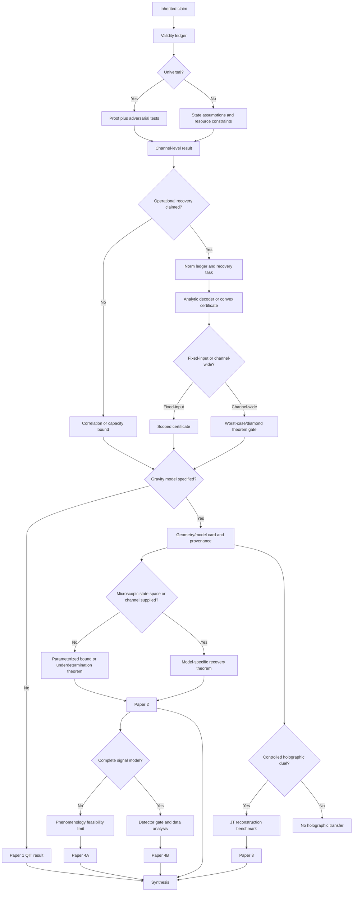

# Research Manifold

## Purpose

The research manifold is the project's navigation and claim-control system. It prevents a result established for one state, channel, geometry, observer, or numerical tolerance from being silently promoted into a universal physical conclusion.

Every major claim occupies

\[
\mathfrak C=(A,M,Q,O,E,P),
\]

where:

- **A — Assumptions:** purity, unitarity, code subspace, dimensions, Hamiltonian, energy, symmetry, locality, asymptotics, accessibility, and numerical tolerances.
- **M — Model:** abstract channel, HRS geometry, Bianchi remnant scenario, JT-bath benchmark, or phenomenological source model.
- **Q — Quantity:** entropy, mutual information, coherent information, recovery fidelity, norm error, capacity, radius, duration, flux, or event rate.
- **O — Observer/output algebra:** full radiation, a subregion, remnant algebra, bath region, exterior observer, or detector.
- **E — Evidence:** proof, imported theorem, counterexample, analytic benchmark, convex certificate, primary source, geometric simulation, or observation.
- **P — Publication state:** hypothesis, internal result, validated result, preprint-ready, submitted, or published.

A claim advances only when all coordinates are recorded.

---

## Core path



---

## Manifold layers

### Layer 0 — Language and coexistence

**Question:** Are systems, states, algebras, channels, and observers defined on a common mathematical object?

Required:

- notation and subsystem diagram;
- explicit purifier;
- time cut;
- operational definition of recovery.

Exit condition: no mutual-information expression contains systems that do not coexist.

### Layer 1 — Quantum-information kinematics

**Question:** What follows from quantum mechanics alone?

Required:

- entropy identities;
- extremal and random channels;
- counterexample catalogue;
- adversarial diagnostic pairs.

Exit condition: every universal statement survives explicit counterexamples.

### Layer 2 — Resource constraints

**Question:** Which declared resources restrict channel freedom?

Candidates:

- finite retained dimension;
- finite Hamiltonian and mean energy;
- conserved charge and superselection;
- symmetry/covariance;
- causal accessibility and locality.

Exit condition: every bound identifies the assumption responsible for it, and no geometry is substituted for a state-space resource without derivation.

### Layer 3 — Recovery certification

**Question:** What operational task succeeds, for which input class, and with what error?

Required:

- fidelity/norm convention;
- input state, ensemble, or code;
- explicit recovery or existence theorem;
- solver/proof certificate;
- feasibility and positivity residuals;
- distinction between fixed-input and worst-case results.

Exit condition: a state-specific Choi calculation is never described as a diamond-norm theorem.

### Layer 4 — Non-holographic gravitational embedding

**Question:** Does the HRS/Bianchi track supply the state-space and dynamics required by the QIT assumptions?

Required:

- HRS equations, roots, and validity domain;
- transition-duration status;
- Hawking/backreaction treatment;
- candidate radiation and remnant algebras;
- Hilbert-space/Hamiltonian provenance;
- missing-input table.

Exit condition: the outcome is a model-specific theorem, a parameterized bound, or an explicit underdetermination result.

### Layer 5 — Holographic benchmark

**Question:** What can be reconstructed from a specified JT-bath radiation region in a controlled code subspace?

Required:

- exact JT setup and bath coupling;
- radiation-region algebra;
- generalized entropy/QES calculation;
- reconstruction theorem and error;
- finite-dimensional surrogate and recovery certificate.

Exit condition: no Page-curve statement is promoted to uniform localization or an explicit decoder.

### Layer 6 — Phenomenology

**Question:** Does a completed model predict detector-level data?

Required:

- population and transition rate;
- emitted spectrum and energy;
- intrinsic duration;
- propagation;
- detector response;
- backgrounds and statistics.

Exit condition: the forward model produces dimensionally checked simulated detector data, and a null result constrains parameters.

### Layer 7 — Publication

**Question:** Is the result reproducible, independently reviewed, and scoped correctly?

Required:

- manuscript and bibliography;
- theorem/validity/norm ledgers;
- scripts and notebooks;
- environment lock and solver artifacts;
- limitations section;
- release tag and archive identifier.

Exit condition: every abstract-level statement points to a proof, certificate, primary source, or documented inference.

---

## Claim coordinate template

```text
Claim ID:
Statement:
Assumptions (A):
Model (M):
Quantity (Q):
Observer/output algebra (O):
Evidence (E):
Publication state (P):
Norm/fidelity convention:
Numerical tolerance or proof status:
Known counterexamples:
Open failure modes:
Next validation action:
```

---

## Current route

| Layer | Current artifact | Status | Next exit action |
|---|---|---|---|
| L0 | Reference-assisted definitions | Validated | Independent notation review |
| L1 | Pure-state identity and adversarial channels | Validated | Publication notebook conversion |
| L2 | Finite-dimension and finite-Hamiltonian bounds | Validated in finite dimension | Charge/symmetry extension |
| L3 | Recovery and environment SDPs | Gated | Passing pinned optimization CI and review |
| L4 | HRS geometry plus Bianchi provenance | Geometry validated; channel underdetermined | Formalize capacity/underdetermination theorem |
| L5 | JT-bath model card | Selected | Fix exact setup and code subspace |
| L6 | Signal-model gate | Blocked | No complete emission/population model |
| L7 | Draft PR and manuscript scaffold | Internal | Independent QIT and gravity review |

---

## Stop rules

Redirect or stop a branch when:

- a universal claim has a valid counterexample;
- a solver returns an unaccepted status or residual;
- a fixed-input result is being promoted to a worst-case theorem;
- a geometry lacks a state space, Hamiltonian, or channel needed by the claim;
- holography is invoked without a defined dual and code subspace;
- a timescale fails dimensional verification;
- a signal lacks a rate, spectrum, duration, or detector model;
- a nondetection cannot constrain parameters;
- an observer algebra or time cut is unstated.

These stop rules are scientific outputs. They prevent a visually persuasive simulation from replacing a justified physical model.
